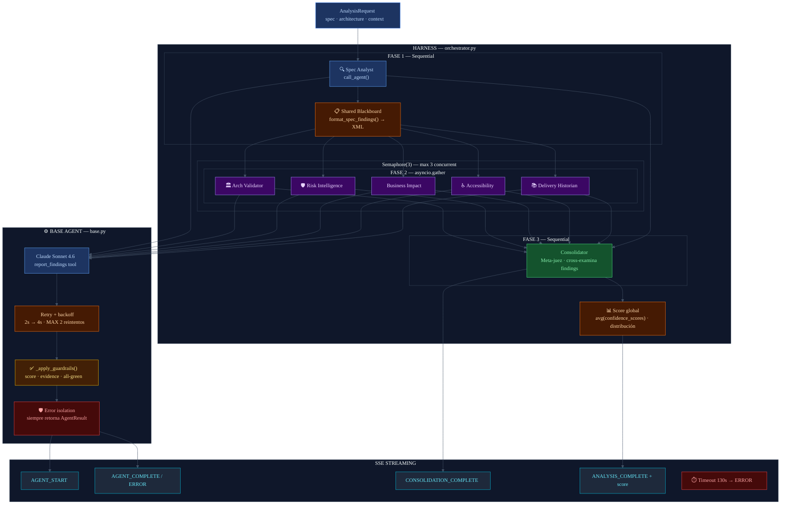

# Harness Engineering
## Diagrama de arquitectura — Confidence Map

---

## Por que se implemento

Los agentes de IA fallan de formas predecibles: se exceden en el uso de la API, generan output
mal formado, producen resultados inconsistentes bajo presion de rate limits, o simplemente
"alucina" con evidencia vaga. Sin un harness, estos fallos se propagan silenciosamente al usuario.

El **harness** es el scaffolding arquitectonico que rodea a los agentes y garantiza que:
- Los errores se capturan y aislan sin romper el flujo completo
- El output de cada agente se valida antes de ser consumido
- Los recursos de API se distribuyen de forma justa entre agentes paralelos
- Los fallos transitorios (rate limits, errores 5xx) se recuperan automaticamente
- El usuario recibe feedback en tiempo real mientras los agentes trabajan

Referencia: [Anthropic Engineering — Harness Design for Long-Running Apps](https://www.anthropic.com/engineering/harness-design-long-running-apps)

---

## Como es aplicado en el proyecto

### Componentes del harness

#### 1. Orquestacion en fases (Phase-based orchestration)

```
Fase 1: Spec Analyst        (sequential — su output informa las demas fases)
         ↓ blackboard
Fase 2: 5 agentes           (parallel — asyncio.gather con semaforo)
         ↓ all results
Fase 3: Consolidator        (sequential — cross-examina todos los findings)
         ↓ sentinel
Fase 4: Score global        (agregacion — promedio ponderado de confidence_scores)
```

#### 2. Semaforo de concurrencia

`asyncio.Semaphore(3)` — maximo 3 agentes llamando a Claude simultaneamente.
Evita saturar rate limits cuando 5 agentes intentan ejecutarse en paralelo.
El cuarto y quinto agente esperan en cola hasta que un slot se libera.

#### 3. Retry policy con exponential backoff

```python
MAX_RETRIES = 2
BASE_DELAY  = 2.0s
# Delays: 2s → 4s → falla definitiva
```
Cubre: `RateLimitError`, `APIStatusError` (5xx).
No reintenta errores 4xx (son errores del cliente, no del servidor).

#### 4. Guardrails de calidad de output

Despues de cada llamada Claude, `_apply_guardrails()` valida:
- **Score-level alignment**: el confidence_score debe caer en el rango de su nivel
  - green: 0.60-1.00 | yellow: 0.30-0.75 | red: 0.00-0.45
  - Si no: se clampea al rango correcto + warning en logs
- **Evidence vacia**: si el agente omite la cita, se sustituye un placeholder
- **All-green distribution**: si todos los findings son verdes en un resultado multi-finding, se loguea un warning de posible bajo analisis

#### 5. Error isolation

`call_agent()` siempre retorna `AgentResult`, nunca lanza excepcion.
Los errores quedan en `result.error` y `result.status = ERROR`.
El orquestador continua con los demas agentes aunque uno falle.

#### 6. SSE streaming (real-time feedback)

El harness emite eventos SSE a medida que cada agente completa:
- `AGENT_START`: el agente comenzo
- `AGENT_COMPLETE` / `AGENT_ERROR`: el agente termino con resultado o error
- `CONSOLIDATION_START` / `CONSOLIDATION_COMPLETE`: el meta-juez actuo
- `ANALYSIS_COMPLETE`: score global + distribucion final
- Timeout: si un evento no llega en 130s, el harness emite un error

#### 7. Blackboard compartido (Shared Blackboard pattern)

Los findings del Spec Analyst (Fase 1) se formatean como XML y se pasan a los 5 agentes de
Fase 2. Esto evita que cada agente redescubra los mismos problemas y los orienta a razonar
desde su dominio especifico.

#### 8. DEMO_MODE (Test harness)

Con `DEMO_MODE=true`, el harness usa resultados pre-generados con delays simulados.
El flujo SSE es identico al modo real — sin consumir creditos de API.
Permite validar la arquitectura completa a $0 de costo.

---

## Diagrama



---

## Comparacion con el patron Anthropic

| Patron Anthropic (long-running) | Implementacion en Confidence Map |
|--------------------------------|----------------------------------|
| Multi-agent specialization | 6 agentes + consolidador con dominios separados |
| External evaluation (Evaluator) | Consolidator: agente separado que juzga el output de todos |
| Structured artifacts | Blackboard XML pasado entre fases |
| Guardrails de calidad | `_apply_guardrails()`: score, evidence, distribucion |
| Rate limiting | `asyncio.Semaphore(3)` |
| Retry + backoff | `_make_api_call()` con exponential backoff |
| Error isolation | `call_agent()` nunca lanza — siempre retorna resultado |
| Environmental continuity | SSE streaming: el usuario ve el progreso en tiempo real |
| Test harness | `DEMO_MODE=true` con mock results identicos en estructura |
| Context reset | No aplica: cada agente es una sola llamada (no multi-turno) |
| Feature registry | No aplica: analisis atomico, no multi-sesion |

---

## Archivos clave en el proyecto

| Archivo | Componente del harness |
|---------|----------------------|
| `backend/confidence_map/core/orchestrator.py` | Orquestacion en fases, semaforo, SSE queue, timeout, score global |
| `backend/confidence_map/agents/base.py` | `_make_api_call()` retry, `_apply_guardrails()`, `call_agent()` error isolation |
| `backend/confidence_map/agents/base.py` | `format_spec_findings()` shared blackboard |
| `backend/confidence_map/core/mock_results.py` | DEMO_MODE test harness |
| `backend/confidence_map/core/settings.py` | `DEMO_MODE`, `MODEL`, `ENABLE_THINKING`, `THINKING_BUDGET_TOKENS` |
| `backend/confidence_map/api/analysis.py` | SSE endpoint — consume los eventos del harness |
