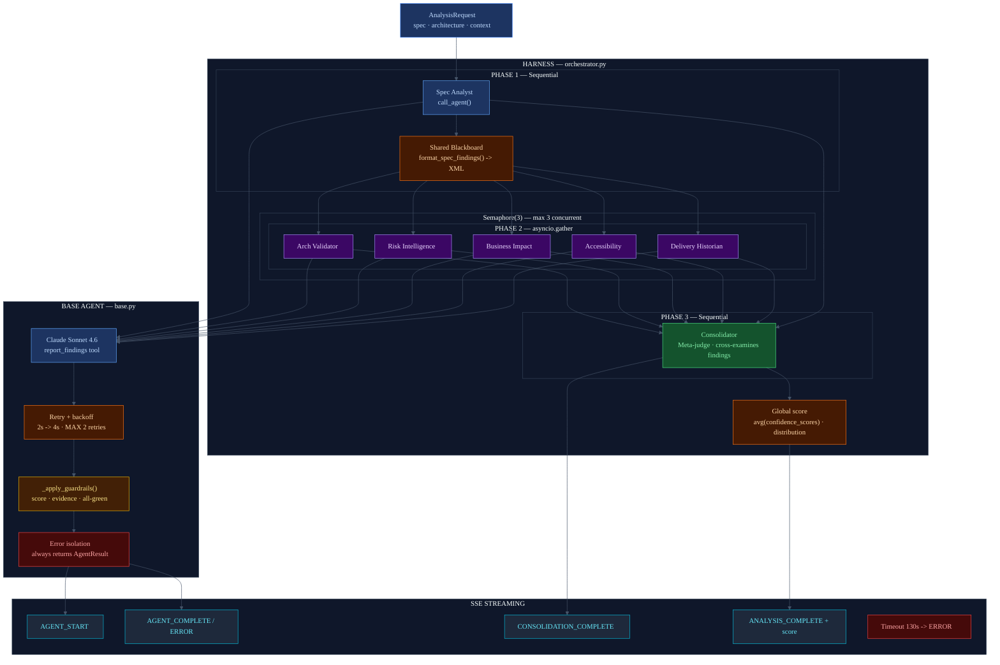

# Harness Engineering
## Architecture diagram — Confidence Map

---

## Why it was implemented

AI agents fail in predictable ways: they exceed API usage, generate malformed output,
produce inconsistent results under rate limit pressure, or simply "hallucinate" with vague
evidence. Without a harness, these failures propagate silently to the user.

The **harness** is the architectural scaffolding that surrounds the agents and ensures that:
- Errors are captured and isolated without breaking the full flow
- Each agent's output is validated before being consumed
- API resources are distributed fairly among parallel agents
- Transient failures (rate limits, 5xx errors) are automatically recovered
- The user receives real-time feedback while the agents work

Reference: [Anthropic Engineering — Harness Design for Long-Running Apps](https://www.anthropic.com/engineering/harness-design-long-running-apps)

---

## How it is applied in the project

### Harness components

#### 1. Phase-based orchestration

```
Phase 1: Spec Analyst        (sequential — its output informs subsequent phases)
         v blackboard
Phase 2: 5 agents            (parallel — asyncio.gather with semaphore)
         v all results
Phase 3: Consolidator        (sequential — cross-examines all findings)
         v sentinel
Phase 4: Global score        (aggregation — weighted average of confidence_scores)
```

#### 2. Concurrency semaphore

`asyncio.Semaphore(3)` — maximum 3 agents calling Claude simultaneously.
Prevents saturating rate limits when 5 agents attempt to run in parallel.
The fourth and fifth agents wait in queue until a slot is freed.

#### 3. Retry policy with exponential backoff

```python
MAX_RETRIES = 2
BASE_DELAY  = 2.0s
# Delays: 2s -> 4s -> definitive failure
```
Covers: `RateLimitError`, `APIStatusError` (5xx).
Does not retry 4xx errors (those are client errors, not server errors).

#### 4. Output quality guardrails

After each Claude call, `_apply_guardrails()` validates:
- **Score-level alignment**: the confidence_score must fall within its level's range
  - green: 0.60-1.00 | yellow: 0.30-0.75 | red: 0.00-0.45
  - If not: clamped to the correct range + warning in logs
- **Empty evidence**: if the agent omits the citation, a placeholder is substituted
- **All-green distribution**: if all findings are green in a multi-finding result, a warning of possible shallow analysis is logged

#### 5. Error isolation

`call_agent()` always returns `AgentResult`, never raises an exception.
Errors are stored in `result.error` and `result.status = ERROR`.
The orchestrator continues with the remaining agents even if one fails.

#### 6. SSE streaming (real-time feedback)

The harness emits SSE events as each agent completes:
- `AGENT_START`: the agent started
- `AGENT_COMPLETE` / `AGENT_ERROR`: the agent finished with a result or error
- `CONSOLIDATION_START` / `CONSOLIDATION_COMPLETE`: the meta-judge acted
- `ANALYSIS_COMPLETE`: global score + final distribution
- Timeout: if an event does not arrive within 130s, the harness emits an error

#### 7. Shared Blackboard pattern

The Spec Analyst findings (Phase 1) are formatted as XML and passed to the 5 Phase 2 agents.
This prevents each agent from rediscovering the same problems and directs them to reason
from their specific domain.

#### 8. DEMO_MODE (Test harness)

With `DEMO_MODE=true`, the harness uses pre-generated results with simulated delays.
The SSE flow is identical to real mode — without consuming API credits.
Allows validating the full architecture at $0 cost.

---

## Diagram



---

## Comparison with the Anthropic pattern

| Anthropic pattern (long-running) | Implementation in Confidence Map |
|----------------------------------|----------------------------------|
| Multi-agent specialization | 6 agents + consolidator with separate domains |
| External evaluation (Evaluator) | Consolidator: separate agent that judges all agents' output |
| Structured artifacts | XML Blackboard passed between phases |
| Output quality guardrails | `_apply_guardrails()`: score, evidence, distribution |
| Rate limiting | `asyncio.Semaphore(3)` |
| Retry + backoff | `_make_api_call()` with exponential backoff |
| Error isolation | `call_agent()` never raises — always returns result |
| Environmental continuity | SSE streaming: the user sees progress in real time |
| Test harness | `DEMO_MODE=true` with mock results identical in structure |
| Context reset | Not applicable: each agent is a single call (not multi-turn) |
| Feature registry | Not applicable: atomic analysis, not multi-session |

---

## Key files in the project

| File | Harness component |
|------|------------------|
| `backend/confidence_map/core/orchestrator.py` | Phase orchestration, semaphore, SSE queue, timeout, global score |
| `backend/confidence_map/agents/base.py` | `_make_api_call()` retry, `_apply_guardrails()`, `call_agent()` error isolation |
| `backend/confidence_map/agents/base.py` | `format_spec_findings()` shared blackboard |
| `backend/confidence_map/core/mock_results.py` | DEMO_MODE test harness |
| `backend/confidence_map/core/settings.py` | `DEMO_MODE`, `MODEL`, `ENABLE_THINKING`, `THINKING_BUDGET_TOKENS` |
| `backend/confidence_map/api/analysis.py` | SSE endpoint — consumes events from the harness |
