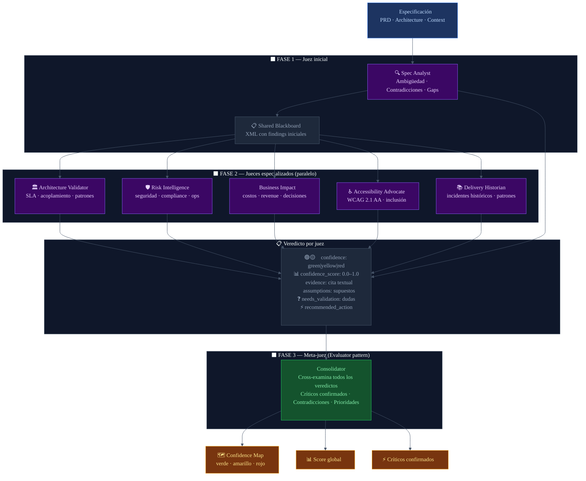

# LLM-as-a-Judge
## Diagrama de arquitectura — Confidence Map

---

## Por que se implemento

Los modelos de lenguaje tienen un problema conocido de auto-evaluacion: cuando se les pide que
revisen su propio trabajo, tienden a validarlo en lugar de criticarlo. La solucion es la misma que
en ingenieria humana: separar quien hace el trabajo de quien lo juzga.

El patron **LLM-as-a-Judge** aplica este principio a la evaluacion de especificaciones: en lugar
de usar un solo modelo que analice todo, se usan multiples agentes especializados que actuan como
jueces independientes, cada uno desde su dominio de expertise.

El resultado es un sistema de evaluacion mas robusto, con menor sesgo, y con veredictos trazables
que muestran en que evidencia se basa cada juicio.

---

## Como es aplicado en el proyecto

### 6 jueces especializados — dominios independientes

Cada agente es un LLM (Claude Sonnet 4.6) con un system prompt especializado que lo posiciona
como experto en un dominio especifico. Ninguno sabe lo que los otros estan evaluando.

| Agente | Dominio | Que juzga |
|--------|---------|-----------|
| **Spec Analyst** | Requisitos | Ambiguedad, contradicciones, requisitos faltantes |
| **Architecture Validator** | Arquitectura | Acoplamiento peligroso, SLAs imposibles, patrones inadecuados |
| **Risk Intelligence** | Seguridad / Ops | Gaps de seguridad, compliance, observabilidad |
| **Business Impact** | Negocio | Costos ocultos, impacto en revenue, decisiones irreversibles |
| **Accessibility Advocate** | Accesibilidad | WCAG 2.1 AA, inclusion, barreras para usuarios con discapacidad |
| **Delivery Historian** | Historia | Incidentes similares en el pasado, patrones de fallo conocidos |

### El veredicto de cada juez

Cada agente emite hallazgos con estructura de veredicto explicito:
- **Nivel**: green (claro), yellow (inferido), red (critico / faltante)
- **Score**: numero 0.0-1.0 que cuantifica la certeza del juicio
- **Evidencia**: cita textual de la spec que respalda el veredicto
- **Supuestos**: lo que el juez esta asumiendo para llegar a ese juicio
- **Preguntas abiertas**: lo que el juez no puede determinar sin mas informacion

### El meta-juez: Consolidator

En la Fase 3, un septimo agente (Consolidator) recibe todos los hallazgos de los 6 jueces y:
- Identifica criticos confirmados (multiples jueces coinciden)
- Detecta contradicciones entre jueces
- Genera recomendaciones de prioridad cruzada

Este es el patron "Evaluator" de Anthropic: un agente separado que juzga el output de los otros.

---

## Diagrama

---

## Diferencia clave con un chatbot

| Chatbot / Copilot | Confidence Map (LLM-as-a-Judge) |
|------------------|--------------------------------|
| Un modelo responde | 7 agentes evaluan de forma independiente |
| La respuesta no tiene nivel de certeza | Cada hallazgo tiene confidence level + score numerico |
| No muestra en que se basa | Evidencia: cita textual obligatoria |
| No dice que esta asumiendo | Supuestos explicitos en cada veredicto |
| No sabe lo que no sabe | `needs_validation`: lista de dudas abiertas |
| Un punto de vista | Multiples dominios, posibles contradicciones entre jueces |

---

## Archivos clave en el proyecto

| Archivo | Rol en LLM-as-a-Judge |
|---------|----------------------|
| `backend/confidence_map/agents/spec_analyst.py` | Juez de requisitos — Fase 1 |
| `backend/confidence_map/agents/arch_validator.py` | Juez de arquitectura |
| `backend/confidence_map/agents/risk_intelligence.py` | Juez de seguridad y riesgos |
| `backend/confidence_map/agents/business_impact.py` | Juez de impacto de negocio |
| `backend/confidence_map/agents/accessibility_advocate.py` | Juez de accesibilidad WCAG 2.1 AA |
| `backend/confidence_map/agents/delivery_historian.py` | Juez historico de delivery |
| `backend/confidence_map/agents/consolidator.py` | Meta-juez — Fase 3 |
| `backend/confidence_map/agents/base.py` | `format_spec_findings()` — blackboard compartido |
