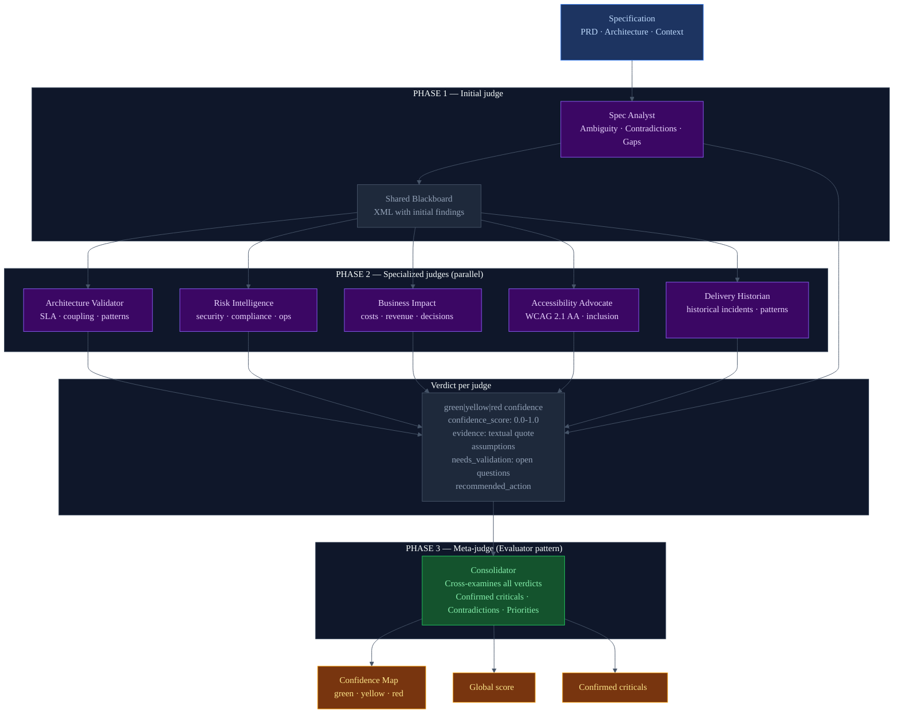

# LLM-as-a-Judge
## Architecture diagram — Confidence Map

---

## Why it was implemented

Language models have a known self-evaluation problem: when asked to review their own work,
they tend to validate it rather than criticize it. The solution is the same as in human
engineering: separate who does the work from who judges it.

The **LLM-as-a-Judge** pattern applies this principle to specification evaluation: instead
of using a single model that analyzes everything, multiple specialized agents are used that
act as independent judges, each from their own domain of expertise.

The result is a more robust evaluation system, with less bias, and with traceable verdicts
that show what evidence each judgment is based on.

---

## How it is applied in the project

### 6 specialized judges — independent domains

Each agent is an LLM (Claude Sonnet 4.6) with a specialized system prompt that positions it
as an expert in a specific domain. None knows what the others are evaluating.

| Agent | Domain | What it judges |
|-------|--------|---------------|
| **Spec Analyst** | Requirements | Ambiguity, contradictions, missing requirements |
| **Architecture Validator** | Architecture | Dangerous coupling, impossible SLAs, inadequate patterns |
| **Risk Intelligence** | Security / Ops | Security gaps, compliance, observability |
| **Business Impact** | Business | Hidden costs, revenue impact, irreversible decisions |
| **Accessibility Advocate** | Accessibility | WCAG 2.1 AA, inclusion, barriers for users with disabilities |
| **Delivery Historian** | History | Similar past incidents, known failure patterns |

### The verdict of each judge

Each agent emits findings with explicit verdict structure:
- **Level**: green (clear), yellow (inferred), red (critical / missing)
- **Score**: number 0.0-1.0 that quantifies the certainty of the judgment
- **Evidence**: textual quote from the spec that supports the verdict
- **Assumptions**: what the judge is assuming to reach that judgment
- **Open questions**: what the judge cannot determine without more information

### The meta-judge: Consolidator

In Phase 3, a seventh agent (Consolidator) receives all findings from the 6 judges and:
- Identifies confirmed criticals (multiple judges agree)
- Detects contradictions between judges
- Generates cross-priority recommendations

This is Anthropic's "Evaluator" pattern: a separate agent that judges the output of the others.

---

## Diagram

---

## Key difference from a chatbot

| Chatbot / Copilot | Confidence Map (LLM-as-a-Judge) |
|------------------|--------------------------------|
| One model responds | 7 agents evaluate independently |
| The response has no certainty level | Each finding has a confidence level + numeric score |
| Does not show what it is based on | Evidence: mandatory textual quote |
| Does not say what it is assuming | Explicit assumptions in every verdict |
| Does not know what it doesn't know | `needs_validation`: list of open questions |
| One point of view | Multiple domains, possible contradictions between judges |

---

## Key files in the project

| File | Role in LLM-as-a-Judge |
|------|----------------------|
| `backend/confidence_map/agents/spec_analyst.py` | Requirements judge — Phase 1 |
| `backend/confidence_map/agents/arch_validator.py` | Architecture judge |
| `backend/confidence_map/agents/risk_intelligence.py` | Security and risk judge |
| `backend/confidence_map/agents/business_impact.py` | Business impact judge |
| `backend/confidence_map/agents/accessibility_advocate.py` | WCAG 2.1 AA accessibility judge |
| `backend/confidence_map/agents/delivery_historian.py` | Historical delivery judge |
| `backend/confidence_map/agents/consolidator.py` | Meta-judge — Phase 3 |
| `backend/confidence_map/agents/base.py` | `format_spec_findings()` — shared blackboard |
