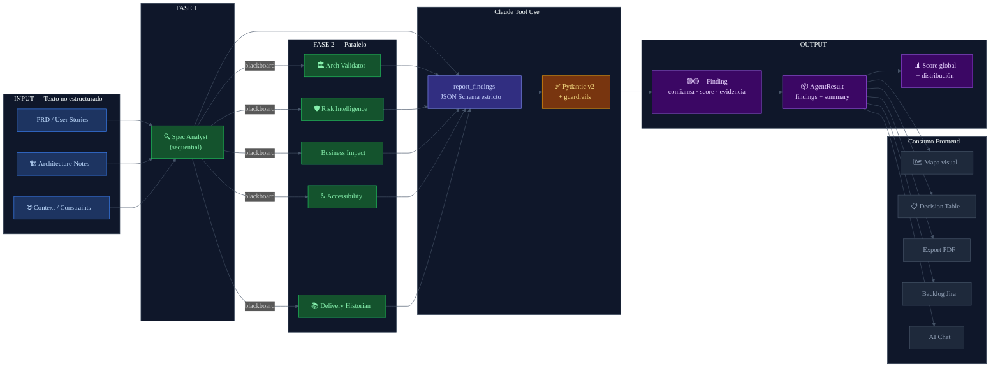

# Spec-to-Data Pipelines
## Diagrama de arquitectura — Confidence Map

---

## Por que se implemento

Las especificaciones de software (PRDs, historias de usuario, documentos de arquitectura) son texto
no estructurado. Los equipos las leen, las interpretan, y toman decisiones — pero ese proceso es
invisible, no trazable, y no comparable entre proyectos.

El desafio de **Spec-to-Data Pipelines** consiste en transformar ese texto en bruto en datos
estructurados, accionables y consultables: hallazgos con tipo, nivel de confianza, evidencia,
supuestos, y acciones recomendadas.

Sin esta transformacion, la IA solo puede "hablar sobre" la especificacion. Con ella, puede
razonar sobre ella, cuantificarla y hacerla visible para todo el equipo.

---

## Como es aplicado en el proyecto

### 1. Input: texto no estructurado

El usuario ingresa hasta tres tipos de texto:
- **PRD / Spec**: requisitos funcionales, historias de usuario, criterios de aceptacion
- **Architecture notes**: decisiones tecnicas, patrones elegidos, dependencias
- **Context**: restricciones regulatorias, SLAs, integraciones externas

### 2. Transformacion: Claude tool use con schema Pydantic

Cada agente recibe el texto y usa la herramienta `report_findings` con un JSON Schema estricto:

```json
{
  "title":             "string (max 100 chars)",
  "description":       "string",
  "confidence":        "green | yellow | red",
  "confidence_score":  "float 0.0-1.0",
  "evidence":          "cita exacta de la spec",
  "assumptions":       ["lista de supuestos"],
  "needs_validation":  ["lista de preguntas abiertas"],
  "recommended_action":"siguiente paso concreto",
  "category":          "ambiguity | contradiction | risk | gap | accessibility | cost | pattern"
}
```

### 3. Output: datos estructurados con trazabilidad completa

Cada hallazgo es un objeto Pydantic validado con:
- Nivel de confianza semantico (verde/amarillo/rojo) + score numerico (0.0-1.0)
- Evidencia: cita textual de la especificacion original
- Supuestos explicitos que el agente esta haciendo
- Preguntas abiertas que el equipo debe validar
- Accion recomendada concreta

### 4. Distribucion y score global

El orquestador agrega todos los hallazgos y calcula:
- Distribucion: cuantos verdes, amarillos, rojos
- Score global de confianza: promedio ponderado de todos los confidence_scores
- Ese numero aparece en el hub central del mapa visual

---

## Diagrama



---

## Archivos clave en el proyecto

| Archivo | Rol en el pipeline |
|---------|-------------------|
| `backend/confidence_map/models/findings.py` | Schema Pydantic de Finding y AgentResult |
| `backend/confidence_map/agents/base.py` | `REPORT_FINDINGS_TOOL` — JSON Schema para Claude tool use |
| `backend/confidence_map/agents/base.py` | `_apply_guardrails()` — validacion post-extraccion |
| `backend/confidence_map/core/orchestrator.py` | Agregacion de findings y calculo del score global |
| `frontend/types/index.ts` | Tipos TypeScript que consumen el output del pipeline |
