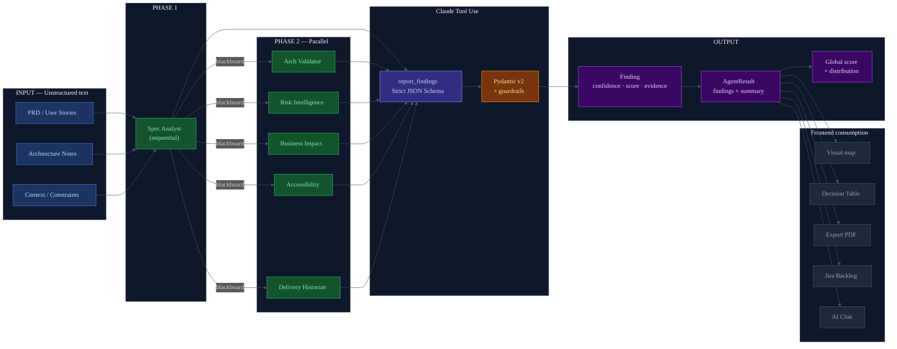

# Spec-to-Data Pipelines
## Architecture diagram — Confidence Map

---

## Why it was implemented

Software specifications (PRDs, user stories, architecture documents) are unstructured text.
Teams read them, interpret them, and make decisions — but that process is
invisible, untraceable, and not comparable across projects.

The **Spec-to-Data Pipelines** challenge consists of transforming that raw text into
structured, actionable, and queryable data: findings with type, confidence level, evidence,
assumptions, and recommended actions.

Without this transformation, AI can only "talk about" the specification. With it, it can
reason about it, quantify it and make it visible to the entire team.

---

## How it is applied in the project

### 1. Input: unstructured text

The user enters up to three types of text:
- **PRD / Spec**: functional requirements, user stories, acceptance criteria
- **Architecture notes**: technical decisions, chosen patterns, dependencies
- **Context**: regulatory constraints, SLAs, external integrations

### 2. Transformation: Claude tool use with Pydantic schema

Each agent receives the text and uses the `report_findings` tool with a strict JSON Schema:

```json
{
  "title":             "string (max 100 chars)",
  "description":       "string",
  "confidence":        "green | yellow | red",
  "confidence_score":  "float 0.0-1.0",
  "evidence":          "exact quote from the spec",
  "assumptions":       ["list of assumptions"],
  "needs_validation":  ["list of open questions"],
  "recommended_action":"concrete next step",
  "category":          "ambiguity | contradiction | risk | gap | accessibility | cost | pattern"
}
```

### 3. Output: structured data with full traceability

Each finding is a validated Pydantic object with:
- Semantic confidence level (green/yellow/red) + numeric score (0.0-1.0)
- Evidence: textual quote from the original specification
- Explicit assumptions the agent is making
- Open questions the team must validate
- Concrete recommended action

### 4. Distribution and global score

The orchestrator aggregates all findings and calculates:
- Distribution: how many greens, yellows, reds
- Global confidence score: weighted average of all confidence_scores
- That number appears in the central hub of the visual map

---

## Diagram



---

## Key files in the project

| File | Role in the pipeline |
|------|---------------------|
| `backend/confidence_map/models/findings.py` | Pydantic schema for Finding and AgentResult |
| `backend/confidence_map/agents/base.py` | `REPORT_FINDINGS_TOOL` — JSON Schema for Claude tool use |
| `backend/confidence_map/agents/base.py` | `_apply_guardrails()` — post-extraction validation |
| `backend/confidence_map/core/orchestrator.py` | Findings aggregation and global score calculation |
| `frontend/types/index.ts` | TypeScript types that consume the pipeline output |
